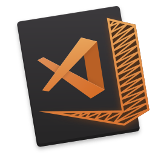

# VS Code Tips and Tricks

### The most useful tips and tricks for VS Code!

<small>[Chris Dias](https://code.visualstudio.com) / [@chrisdias](http://twitter.com/chrisdias)</small>

---

# Slides in Markdown

Who knew?

---

# Themes in Markdown
 
<a href="#" onclick="document.getElementById('theme').setAttribute('href','css/theme/black.css'); return false;">Black</a>

<a href="#" onclick="document.getElementById('theme').setAttribute('href','css/theme/white.css'); return false;">White</a>

<a href="#" onclick="document.getElementById('theme').setAttribute('href','css/theme/league.css'); return false;">League</a>

<a href="#" onclick="document.getElementById('theme').setAttribute('href','css/theme/sky.css'); return false;">Sky</a>

<a href="#" onclick="document.getElementById('theme').setAttribute('href','css/theme/simple.css'); return false;">Simple</a>

<a href="#" onclick="document.getElementById('theme').setAttribute('href','css/theme/blood.css'); return false;">Blood</a>

<a href="#" onclick="document.getElementById('theme').setAttribute('href','css/theme/night.css'); return false;">Night</a>

<a href="#" onclick="document.getElementById('theme').setAttribute('href','css/theme/moon.css'); return false;">Moon</a>

<a href="#" onclick="document.getElementById('theme').setAttribute('href','css/theme/solarized.css'); return false;">Solarized</a>

---

# How long will this go on?

---

# 40 minutes left

Let's do 40 tips and tricks

---

# And a go...
(From Shrek, the XBox game)

---

## What will we cover?

* Setup and Configuration
* Code Editing
* Debugging
* ...   

| Tables        | Are           | Cool  |
| ------------- |:-------------:| -----:|
| col 3 is      | right-aligned | $1600 |
| col 2 is      | centered      |   $12 |
| zebra stripes | are neat      |    $1 |

---

<!-- .slide: style="text-align: left;" -->
# @code

- [Tips and Tricks](https://bleck)
- [Visual Stuido Code](https://code.visualstudio.com)
- [The Repo](https://github.com/microsoft/vscode)