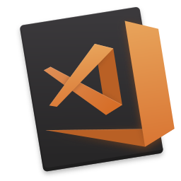

# VS Code Tips and Tricks

### The most useful tips and tricks for VS Code!

<small>[Chris Dias](https://code.visualstudio.com) / [@chrisdias](http://twitter.com/chrisdias)</small>

---

# Slideshow Themes in Markdown in VS Code
 
<a href="#" onclick="document.getElementById('theme').setAttribute('href','css/theme/black.css'); return false;">Black</a> - <a href="#" onclick="document.getElementById('theme').setAttribute('href','css/theme/white.css'); return false;">White</a> - <a href="#" onclick="document.getElementById('theme').setAttribute('href','css/theme/league.css'); return false;">League</a> - <a href="#" onclick="document.getElementById('theme').setAttribute('href','css/theme/sky.css'); return false;">Sky</a> - <a href="#" onclick="document.getElementById('theme').setAttribute('href','css/theme/simple.css'); return false;">Simple</a> - <a href="#" onclick="document.getElementById('theme').setAttribute('href','css/theme/blood.css'); return false;">Blood</a> - <a href="#" onclick="document.getElementById('theme').setAttribute('href','css/theme/night.css'); return false;">Night</a> - <a href="#" onclick="document.getElementById('theme').setAttribute('href','css/theme/moon.css'); return false;">Moon</a> - <a href="#" onclick="document.getElementById('theme').setAttribute('href','css/theme/solarized.css'); return false;">Solarized</a>

---

## What will we see?

|||
|-|-|
| **Setup** | Insiders, Multi-Root Workspaces |
| **Configuration** | Themes, Workspace Settings |
| **Key Binding** | Printable PDF, Window Mgmt, Tasks |
| **Debugging** | Running builds before launch |
| **Code Editing** | Refectoring, Emmet |
| **Terminal** | Custom shell, Running commands |
| **SCC** | Configure git, Diff |
| **Extensions** | Hello World in 30sec |

---

# Let's Go!

---

<!-- .slide: style="text-align: center;" -->
# @code

- Follow us [@code](https://twitter.com/code)
- [Tips and Tricks](https://github.com/microsoft/vscode-tips-and-tricks)
- [Visual Stuido Code](https://code.visualstudio.com)
- [The Repo](https://github.com/microsoft/vscode)

